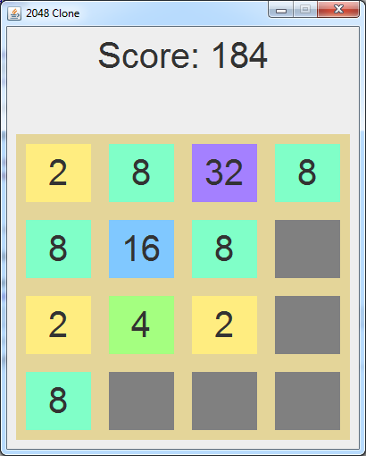

2048-clone-solver
=================

A clone of the iPhone game 2048. Attempts to make the best possible move.

Controls:
- Use arrow keys to move the blocks. 
- Press "p" to make an auto-move based on point total prediction.
- Press "c" to make an auto-move based on board complexity prediction.

This is proof of concept and I have no intention of continuing work on this project.

The solver function by attempting all possible moves within a specified number of turns.
The 4 possible moves are stored in 2 bit chunks of a `long`.
Bit shifting is utilized to store the move history within a single piece of data.
The algorithm recursively searches many moves comparing the score after each search.
If a new high score is found, the `long` that represents that history of moves is saved.
After trying all moves to a given turn depth, the program returns the first move associated with the highest scoring history.

The solver is at most adequate. Because of the random generation of tiles which the solver does not take into account for, the best move is only a rough estimate. I would say this solver is better than a beginner but much worse than an experienced player. It has never gotten close to the 2048 tile but has beaten my personal high score before. I am very bad at 2048.

